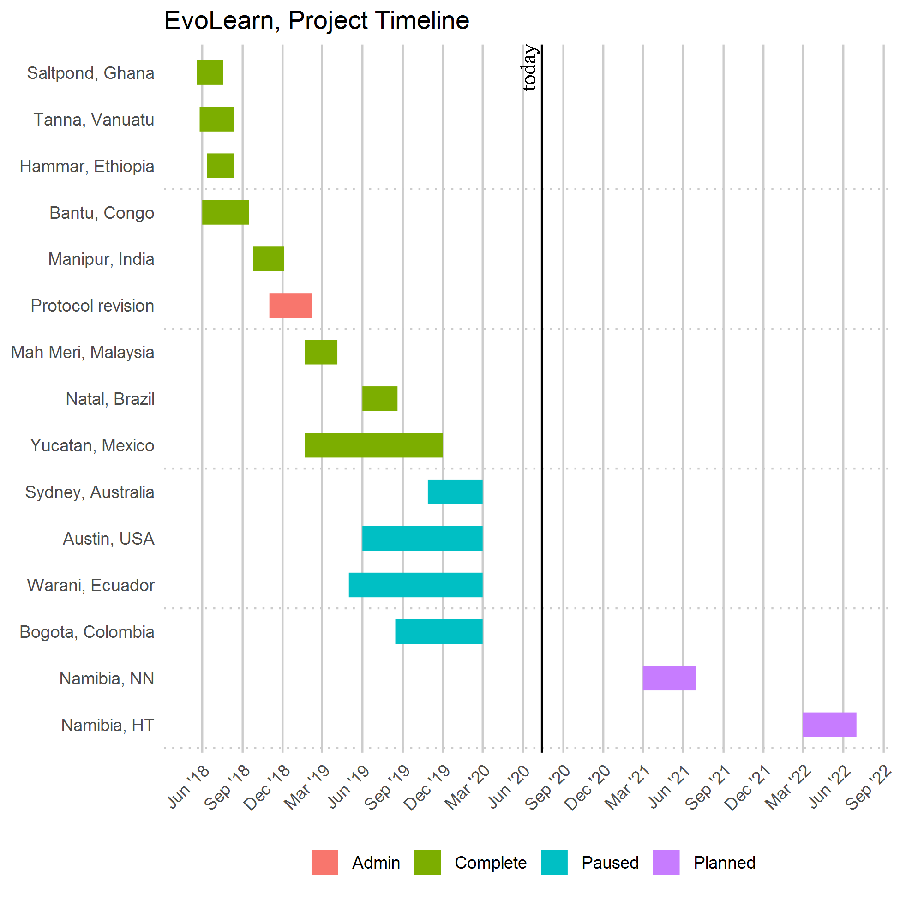
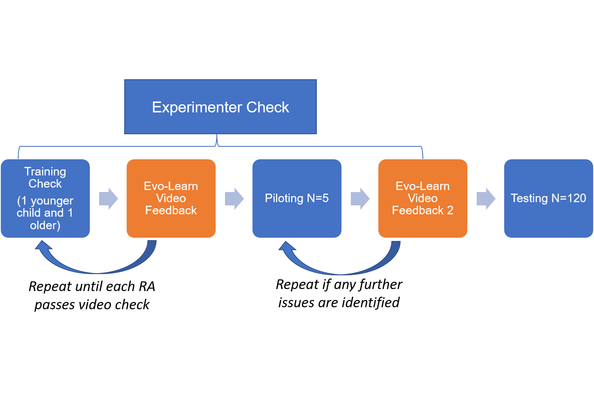

# Introduction {#intro}

\chapter{Introduction and overview}

## Introduction and overview

\section{Purpose}

### Purpose

The National Science Foundation award \href{https://www.nsf.gov/awardsearch/showAward?AWD_ID=1730678&HistoricalAwards=false}{1730678} titled "The Development of Teaching and Social Learning Across Cultures" is a multi-site mixed-methods international research project designed to understand how exposure to formal education influences strategies of teaching and social transmission, as well as how these factors vary as a function of (or are mediated by) health, demographics, and cultural context.
The project also goes by the shorter name Project EvoLearn.
The Project EvoLearn Principle Investigator (PI) is [Dr. Cristine Legare](#http://www.cristinelegare.com), of the University of Texas at Austin.

The purpose of this document is to summarize the field methods, task protocols, and data handling guidelines for Project EvoLearn[^intro-1].
The main goal is a clear articulation of the project's procedures.
The rationale of the project are presented in brief, to provide some motivational context for the tasks and methods in the project.

[^intro-1]: please direct questions/comments/corrections to [oskar\@austin.utexas.edu](mailto:oskar@austin.utexas.edu){.email}

```{=tex}
\section{Project Rationale, in Brief}
\label{sec:rationale}
```
### Project Rationale, in Brief

The human propensity for high fidelity social transmission is key to the accumulation of cultural complexity.
Project EvoLearn examines variation in social learning and teaching strategies during development and across cultures.
Despite evidence that styles of teaching and learning vary across populations, little is known about sources of this variation.
Further, how exposure to formal education affects learning and teaching practices cross-culturally is of growing international interest because of increasing access to formal education.
<!--  and decreasing research opportunities to understand how these global changes alter strategies of learning and teaching. and hence social transmission and culture change.  --> Finally, psychology in general has seen growing acceptance that it has overly-relied on Western populations, thus recognizing the need to improve understanding of the development of cognition cross-culturally, and among non-Western populations in particular.

With these overarching motivations in mind, Project EvoLearn has the following broad objectives:

1.  build a collaborative network of international field sites that make it possible to examine population and individual-level variables that may impact teaching practices and social learning strategies.

2.  design a multi-task protocol providing accurate and replicable measures of the key project domains -- cognitive development, social transmission (teaching and learning), and academic achievement.

3.  combine these measures and fieldsites to:

    1.  assess the extent to which exposure to formal education (schooling) influences cognitive and social developmental outcomes

    2.  examine the cultural context of teaching and social learning

<!-- In addition, Project EvoLearn will collect the kind of demographic and mixed-methodological data required to address such challenging and pressing issues about the interactions  between  formal  education, teaching strategy, social transmission, and various health measures.  -->

We evaluate the hypothesis that teaching and social learning differ both in style and in practice within and among populations.
Project EvoLearn compiled a battery of 12 tasks, some of which were modified from the existing literature and and some were developed specifically for this project.
These tasks examine social learning, teaching, cognitive development, and academic achievement.
We also conduct interviews with adults, teachers, collect observational data of teachers and children (where possible), and collect demographic and other contextual information on the villages and local schools.
Taken together, this task battery and set of data sources will provide a comprehensive dataset from which the project's central question can be evaluated.
A key challenge for reaching these objectives is standardization across the processes of data collection, entry, storage, and editing.
This Project Manual is primarily concerned with such data management issues and is intended to be a comprehensive guide to collecting, storing, and handling data for this project.

\section{Fieldsites}

### Fieldsites

Figure \@ref(fig:gantt) shows a project timeline with planned, ongoing, and completed data collection activities.

{#gantt}

```{=tex}
\begin{figure}[h]
\centering
\includegraphics[width=0.99\linewidth]{images/EvoLearntimeline20200714.png} 
\caption{Project EvoLearn Timeline -- The vertical line labeled "today" refers to the day that the chart was most recently drafted.}
\label{fig:gantt}
\end{figure}
```
\chapter{Tasks and Data Sources}

\section{Purpose}

## Tasks and Data Sources

### Purpose

This chapter explains the task battery, the supplementary data sources, and related procedures.
This includes general discussion of the tasks and pointers for implementing them in the field.

```{=tex}
\section{RA Training and In-field piloting}
\subsection{RA Training}
\label{sec:RAtraning}
```
### RA Training and In-Field Piloting

#### RA Training

This project employs a fairly extensive task battery.
Because the project is comparative, every effort needs to be made to ensure that protocols are precisely followed at each fieldsite.
A key aspect of careful and consistent task execution is the training of Research Assistants (RAs).
Any individual who collects task data on the project should be rigorously trained.
\textbf{Each RA who collects data on the project} should go through the following general steps:\

```{=tex}
\begin{enumerate}
    \item RAs should be familiar with this manual, the protocols, and have thoroughly reviewed the training materials provided on UT Box.
    \item Conduct a `training check' video. This entails filming test-runs of all the tasks with one younger and one older child. These children do not need to be from the study population. 
    \item Submit the training check videos for review and comment to UT core team
    \item UT core team provides feedback
    \item Repeat until the tasks are being flawlessly executed by each RA who will conduct data on the project
\end{enumerate}
```
    1.  RAs should be familiar with this manual, the protocols, and have
        thoroughly reviewed the training materials provided on UT Box.

    2.  Conduct a 'training check' video. This entails filming test-runs of
        all the tasks with one younger and one older child. These children
        do not need to be from the study population.

    3.  Submit the training check videos for review and comment to UT core
        team

    4.  UT core team provides feedback

    5.  Repeat until the tasks are being flawlessly executed by each RA who
        will conduct data on the project

```{=tex}
\subsection{In-field Piloting}
\label{sec:infield}
```
#### In-Field Piloting

In the following Section, [The Tasks], the Project EvoLearn tasks are presented in detail.
Before engaging with the tasks, what they measure, and how they are executed, it is critical to note that participants in different field settings may view the tasks in very different ways.
What is easy or enjoyable in one place, may be irritating, unsettling, or simply highly unusual in another.

For this reason it is important to pilot the tasks in each unique field setting.
In doing so, researchers ensure that participants are aware, in accordance with IRB guidelines, that participation is voluntary and that anyone can abandon a task at any time without losing any compensation that may apply.
Further, doing an in-field pilot session, provides an additional opportunity to check that the protocols are being closely followed.

In-field piloting sessions should be used at each fieldsite.
The in-field piloting should begin after the individuals collecting the data (RAs, postdocs, Phd students, etc) are fully trained to conduct the tasks.
The in-field piloting is considered \`live' data collection; data from these sessions will be included in the final sample, provided no issues are identified.
In-field piloting can go through the following steps:

```{=tex}
\begin{enumerate}
    \item \textbf{For each RA,} run the full set of tasks for $\sim$5 participants who differ in age 
    \item During the piloting, researchers should keep an especially 
    vigilant eye for signs of participant discomfort or fatigue, making any notes to share with the core team (at UT-Austin) as necessary. i.e., Perhaps a certain task is too difficult or leads to feelings of social discomfort or awkwardness. If any reaction along these lines is commonly associated with a task in a given field site, it will be removed from the task list at that field site.
    \item Once 5 pilots have been run, upload the videos and scoresheets to UTBox and schedule a phone or skype meeting with core project personnel to review the videos and discuss any questions that arise.
    \item The in-field piloting videos will be reviewed and if there are no protocol violations or other concerns, then data collection can begin at that fieldsite. 
\end{enumerate}
```
    1.  **For each RA,** run the full set of tasks for $\sim$5 participants
        who differ in age

    2.  During the piloting, researchers should keep an especially vigilant
        eye for signs of participant discomfort or fatigue, making any notes
        to share with the core team (at UT-Austin) as necessary. i.e.,
        Perhaps a certain task is too difficult or leads to feelings of
        social discomfort or awkwardness. If any reaction along these lines
        is commonly associated with a task in a given field site, it will be
        removed from the task list at that field site.

    3.  Once 5 pilots have been run, upload the videos and scoresheets to
        UTBox and schedule a phone or skype meeting with core project
        personnel to review the videos and discuss any questions that arise.

    4.  The in-field piloting videos will be reviewed and if there are no
        protocol violations or other concerns, then data collection can
        begin at that fieldsite.

Tasks to pay special attention to, in terms of in-field piloting, include: the knot tasks, academic knowledge assessment, phonological recall, categorical verbal assessment, and HTKS, but all tasks should be examined for any site-specific concerns.

Once this in-field piloting is complete, we ask that Project personnel collecting data at a fieldsite get in touch with the core team (at UT Austin) to discuss the tasks and any impressions based on the in-field piloting.
%If any questions or concerns should arise during the in-field piloting then they can be addressed in this meeting with central project personnel.
In some cases adjustments may be possible, but worrisome tasks for a particular fieldsite may be cancelled in that location.

\subsection{Overview of RA training and in-field piloting}

#### Overview of RA training and in-field piloting

This process of training RAs and conducting an in-field pilot session is summarized in [\#checkprocess](#checkprocess "checkprocess"){#checkprocess .fig} \ref{fig:checkpro}.
Note that there are several points of exchange between the RAs and the core team in Austin for feedback: during the training process, the training videos (which are done until the tasks are flawlessly executed), and the in-field piloting.
Ideally, the protocols are being followed perfectly before the in-field piloting.
The in-field piloting should focus more on identifying any site-specific nuances in how the participants relate to the tasks than on correcting protocol deviations.

{.fig}

```{=tex}
\begin{figure}[h]
\centering
\includegraphics[width=1.1\linewidth]{images/checkprocess.png} \caption{Process for checking protocol adherence and fidelity of task execution}
\label{fig:checkpro}
\end{figure}
```
```{=tex}
\section{The Task Battery}
\label{sec:Tasks}
```
### The Tasks

A key endeavor of Project EvoLearn is to compile, develop, and modify, as needed, a set of tasks that makes it possible to test hypotheses outlined in the project proposal.
As mentioned above (Section\~\ref{sec:rationale} these involve studying how learning and teaching behaviors are affected by: a) exposure to formal education, and b) cultural context, as mediated by c) health and demographic factors.
The list of tasks selected for project EvoLearn are in Table\~\ref{tab:table3}.

The subset of tasks conducted at any given fieldsite, and/or a ranking of their priority, will be determined by discussion before field-work begins.
A form has been developed to help facilitate discussion about the subset of tasks that will be carried out at any given fieldsite, given locally unique constraints or concerns see\~\ref{itm:collabsurv} (the questions on the form can be answered via email).
%Also, this is meant to be a sequential ordering of the tasks.

In most cases it will be more efficient to do a few tasks in a single session.
For instance, Biometrics are usually done early on because they are a nice break from the experimental tasks.
Biometrics and participant surveys can be done in-between testing sessions.
In many cases these are best done early on because they serve to get acquainted with the participants.
Also, the participant survey and the PID Registry need to be completed for every single participant, so doing them early on helps ensure they don't get overlooked.

At many of the fieldsites it may not be possible to complete all of the tasks in Table\~\ref{tab:table3} at the idealized target sample sizes of 120 to 150 participants (for more discussion of sample size concerns see \~\ref{sec:Sampsize}).

REMINDER: If at any time participants appear stressed or uncomfortable during a task, pause and assess if the situation can be improved and what the cause and severity of distress might be.
If the situation cannot be completely and immediately improved then do not continue the task with that participant.
Please remember to re-assure the participant that their participation is greatly appreciated and that it is not a problem if they do not finish the task.
Further, remember to keep close tabs during each task and if the levels of discomfort are present across multiple participants or if failure rates are high then discontinue the task for the time being and communicate with project personnel at UT Austin.
Tasks that place any undue stress on participants must be discontinued \footnote{This statement was added on September 28th 2018 to ensure that this important point received greater emphasis}.

```{=tex}
\begin{table} [h!]
  \begin{center}
    \caption{EvoLearn Tasks\tablefootnote{An earlier version of this manual included a ranking of priority in the left column of this table. This was dropped on $\sim$ 10/10/2018. The priority list inadvertently gave the impression that one should begin at priority 1 and move sequentially through them, when in fact it was better to group tasks into sessions based on other (locally practical) criteria. The ranking seemed too rigid so we abandoned it. Also, some tasks are more appropriate or ideal at some fieldsites than others and the subset of tasks done at a given location should be a function of discussion and not the ranking in this table (see \ref{itm:collabsurv}.}}
    \label{tab:table3}
    \begin{tabular}{S|p{6.25cm}}
      \toprule % <-- Toprule here
      \textbf{Task} & \textbf{Project Dimension(s)}\\
    %  $\alpha$ & $\beta$ & $\gamma$ \\
      \midrule % <-- Midrule here
    PID Registry & participant de-identification, general info \\
    Participant survey & health, demography, general info \\
    Community survey & description of fieldsite \\
    Biometric Data & health and demography \\
    %Child interview & education, health\\
    Child/peer knot & teaching, social transmission \\
    Caregiver knot & teaching, social transmission\\
    Chain knot & teaching, social transmission \\
    Necklace over-imitation & imitation, social transmission \\
    Tube task & innovation \\
    Academic knowledge & educational exposure\\
    Puzzlebox &  imitation, social transmission\\ % imitation is kind of social trans
    Phonological recall & cognitive development \\
    Marshmallow task & self regulation \\
    HTKS\footnote{Head Toes Knees Shoulders}& cognitive development\\
    Categorical verbal assessment & cognitive development\\
    %Adult interview & health and demography \\
    Queensland & cognitive development, (maybe) intelligence \\
      \bottomrule % <-- Bottomrule here
    \end{tabular}
  \end{center}
\end{table}
```
The tasks in Table\~\ref{tab:table3} are intended to capture the Project EvoLearn domains:

```{=tex}
\begin{itemize}
    \item Educational exposure
    \item Cognition (broadly defined, including cognitive development, executive function, working memory, \& school quality)
    \item Teaching, learning, and social transmission
    \item Health and demography 
\end{itemize}
```
\subsection{Tracking progress on task completion}

Because there are many tasks, many participants, and fieldwork is difficult, we recommend using a task-tracking spreadsheet.
A template for this is provided in the UT Box folder for data entry templates (it is called \`\`ParticipantTaskChecklist.xlsx'').
The template contains directions on the readme tab, but essentially each participant is entered, along with their age and sex, and each time a task is completed it is checked off.
This makes it easy to assess at a glance how many participants have completed which tasks.
It is also useful for communicating progress back to the core team.

\section{Task Order Instructions}

For the Biometrics and Chain Teaching Tasks, order does not matter.
These can be interspersed with the other tasks, although many researchers have preferred to do Biometrics early in data collection.
Researchers should track the dates of task administration on a checklist as well as on the scoresheets.

%Ideally, the order of the Peer-Teaching and Caregiver-Teaching knot tasks would be counter-balanced.

The participant survey should be done as soon as possible, to ensure that the baseline demographic information is collected on all participants.

The Social Learning and Cognitive Tasks should generally be conducted in the following order:

```{=tex}
\begin{enumerate}
    \item Over-imitation task 1 (Necklace or Puzzlebox, consult counter-balance sheet)
    \item Tube 
    \item Academic Knowledge Assessment
    \item Over-imitation task 2 (Necklace or Puzzlebox, whichever wasn't done at step 1)
    \item Phonological Recall
    \item Marshmallow
    \item HTKS
    \item Categorical Verbal Assessment
\end{enumerate}
```
The Queensland is only conducted with participants older than 9 and can be done after completion of all 8 of the Social Learning and Cognitive Task set.

\section{Educational Exposure}

Central to Project EvoLearn is the prediction that behaviors (or strategies) of learning and teaching will vary as functions of exposure to formal education.
This makes exposure to education an essential predictor variable that will be used in much of the analysis of project data, both within and among sites.
Measuring "education" is complicated because there are several contributors to the duration, intensity, quality, and prevalence of exposure that could be important for understanding the influence of education on the project's dependent variables.
While this is not an easy task, note that the term "exposure" in this case clearly implies an amount.
Years spent in education is recorded on the participant survey\footnote{formally (before 29NOV2018) years in education was recorded on the adult and child interview forms, which were later replaced with the participant survey.}.
Several other sources of data speak to the type and quality of that exposure (teacher interview, %focal follows, community survey, and school survey), but these will generally play the roles of moderator or control variables in the analysis.

With these complexities in mind, the following tasks record data about the amount, quality, and type of educational exposure:

```{=tex}
\begin{itemize}
    \item Teacher interview: provides insight into the subjects taught, teaching practices, attitudes towards teaching, the languages spoken in school, and the support provided for teachers in each community. 
   \item Participant survey: asks information about school attendance, subjects learned, degrees/certificates obtained, attitude toward school, distance and mode of travel to school, language ability, etc. 
    \item School assessment: This assessment records data on school quality with questions about subjects taught, number of rooms, the distance students travel to reach it, how often it is open, etc. 
    \item Academic knowledge assessment: this is a measure of the outcome of exposure to schooling. It is not a measure of cognition. It measures literacy and numeracy. 
\end{itemize}
```
\section{Cognition}

Project EvoLearn investigates how exposure to formal education affects teaching and learning.
Exposure to education is expected to have a noticeable effect on styles of teaching and learning, but this does not capture cognitive ability, which likely varies independently of formal education, especially if demography, wealth, and health are controlled for.
There is also much to be learned about the developmental effects of exposure to education.
In order to understand how variation in these various domains explain variation in social learning strategies (and to disentangle the pathways among formal education, social transmission, and cognitive development) we collect data using the following tasks:

```{=tex}
\subsection{Cognition tasks}
\begin{itemize}
    \item Marshmallow task -- a popular measure of self-regulation. The ability to self-regulate, which here means to wait 10 minutes to get two treats rather than having one immediately, is thought to correlate, or even predict, cognitive ability and success in wealthy industrial societies. This finding needs further evaluation, especially in cross-cultural perspective,  which is needed to understand the roles of social learning, cultural context, and education on self-regulation. We would like to evaluate the possibility that self-regulation is less strongly linked to cognitive ability than commonly thought, and to what degree it is linked to social learning and cultural context. Self-regulation may be a predictor of outcome when it is tied to wealth and SES.    
    \item HTKS -- Captures inhibition (self-regulation), attention, and working memory in a nonverbal capacity - similar to the 'Simon Says' game in which children must do the opposite to the experimenter and thereby inhibit their initial tendency. The relation between these cognitive processes and educational exposure will be evaluated.   
    \item Categorical verbal assessment -- verbal fluency is an indicator of vocabulary size, lexical access speed, updating, and inhibition ability. This task simply requires children to free-list animals and plants within a set time period.
    \item Phonological recall -- Subjects listen to a series of either familiar or unfamiliar words and are then asked to recall them in 1) the order they were listed or 2) in the reverse order. 
    \item Queensland Task -- This is a nonverbal measure of cognitive performance (including working memory, nonverbal recall, spatial reasoning) that will be used to relate to children's learning strategies. It quantifies some aspects of executive functioning and is thought by some to be a fairly cultural neutral measure of cognition. 
\end{itemize}
```
\section{Social Transmission}

Social transmission is the transfer of information among individuals.
In humans this transmission can occur verbally and non-verbally.
Important mechanisms of social transmission include teaching and imitation.
Likewise, transmission may occur vertically (from parent to offspring), or horizontally (among peers).

Social transmission makes it possible for humans to accumulate instrumental skills and social conventions.
Retention of cultural practices requires high fidelity transmission to occur, but for cultural evolution (new ideas or modifications to existing technologies, etc) innovation must also be possible.
Both the degree of fidelity in socially transmitted information and the frequency of innovation are likely to vary by population, age, context, nature of the activity, and other factors.

To understand how exposure to education affects social transmission, Project EvoLearn developed or adopted tasks that identify variation in processes of learning and teaching.

Both teaching and learning vary within and across cultures.
Just as the methods and style of teaching and learning may differ in contexts of instrumental skills (knot tying) vs social conventions (necklace making) so teaching styles of a population from Northern US differs from those in the Congo Basin.

```{=tex}
\subsection{Social transmission tasks}
\begin{itemize}
    \item Child/peer knot: In this task one child learns how to tie a knot and then teaches that knot to a peer. This structured task is filmed and coded. Social transmission strategies may be different in horizontal vs vertical transmission settings. This task identifies horizontal transmission of like-aged peers.  
    \item Caregiver knot: This is a similar design as the child/peer knot task, but captures vertical transmission strategies from caregivers to children.  
    \item Chain knot: This task is conducted in school settings and follows a Telephone--game design whereby one child learns the knot,before teaching another child. The second child then teaches a third child, who in turn teaches a fourth, and so on. \textit{This task has not been executed in the first several field sites, in part because it involves having access to 5 like-aged children for each instance of the task.}
    \item Necklace task: This task measures over-imitation (copying causally irrelevant actions) by measuring whether children repeat unnecessary actions demonstrated by an experimenter in a necklace making context. %The necklace task includes a ``helping task'' that measures a child's spontaneous giving of help when an adult's hands are occupied.
    \item Tube task: this captures asocial learning or innovation by requiring children to solve a novel tool use problem. 
    \item Puzzlebox: over-imitation, as with the Necklace Task, but in a puzzlebox solving context. 
\end{itemize}
```
\subsection{Health and demography}

Health and demography influence several social and developmental domains, which in turn may affect the ability to regularly attend school, interest in learning, how learning is approached, and many other relevant factors.

The data collection tasks associated with demographics and health include:

```{=tex}
\begin{itemize}
    \item Biometrics: all Project EvoLearn participants will complete a biometric survey. This captures non-intrusive health measures like height, weight, BMI, grip strength, arm circumference, and handedness.  
    \item PID Registry: this is used to track individual participants, to de-identify the data, and record personal characteristics of people that do not change, like birth and death dates. The PID Registry must be handled and stored differently from other Project Evolearn data.  
    \item Participant Survey: a questionnaire for all project participants (children and caregivers) that covers demographic information, educational experiences, and some information on health and economic security (from adult participants)\footnote{This survey was a replacement for the adult survey. It achieved greater standardization across participants and was shorter than the previous iteration.}. 
\end{itemize}
```
\section{Additional Data Sources}

In addition to the tasks listed above, a few additional data collection efforts are planned for each fieldsite.
These include:

```{=tex}
\begin{enumerate}
    \item Site and sample description: a description of the fieldsite's socio--economic and geographic setting. If the site is a small remote village, this sample description may include: 
    \begin{itemize}
        \item the community survey form is the main formal guide for obtaining standard information on each fieldsite. 
        \item a sketch map of the village, highlighting household locations that can be cross-referenced to the census/demographic information
        \item if possible and relevant, GPS points outlining the village and noting household locations
        \item a crude village census that can provide age and sex breakdown of the whole community, even those not directly participating in the study (again, only where possible and relevant), see `Walk Around Survey' protocol in \ref{chapter:AppendixA}. 
    \end{itemize} 
    \item PID Registry: see Section~\ref{sec:PID} for more detail, but a registry of each participant of the study is an essential data collection effort of this project. The PID registry is also linked to the system of data de-identification. In short, this links an ID code to each participant and includes information that will not change, such as date of birth, sex, etc.  
    \item Teacher interview (Section~\ref{chapter:AppendixA}): An interview given to four teachers per school, documents teacher background, experience, and subjects taught  
    \item School survey (Section~\ref{chapter:AppendixA}): A survey form to capture school resources, applied to four schools per field site
    \item Home life events are filmed for coding. These are specifically focused on rituals, religious behavior in general, foraging, mealtimes, infant feeding, and the classroom.
    \item Home-life drawings of households depicting the number of individuals sleeping in one household, any cooking areas, and the building materials used. [This needs to be supplemented with images. We need a protocol for this.] 
   
\end{enumerate}
```
NOTE: some of these are optional and are more pertinent to some fieldsites than others.
NOTE: the PID Registry has several facets that are not covered elsewhere and hence warrants its own section.

```{=tex}
\section{PID Registry}
\label{sec:PID}
```
\textbf{Do not email the PID Registry. When submitting the PID Registry to Project EvoLearn, use the secure UT Box server. The PID Registry is not stored in the same location as the other data files.\footnote{if you are not sure where the PID Registry should be stored please contact \href{mailto: oskar@austin.utexas.edu}{oskar burger.}} Every single participant must be entered into the PID Registry. They should be entered as soon as they enter the study for any task, observation, or interview.}

Each fieldsite will need a set of participant identification numbers (PIDs) to link data on individuals across tasks/datasets and to de-identify the data in accordance with IRB and Project EvoLearrn data management standards.

One PID Registry file will link the PID to a participant's personal information.
In all other datasets only the PIDs will be used.
PIDs are also useful for linking observations across field seasons.

Project EvoLearn is a collaborative network of researchers with different fieldsites and, of course, different associated histories of research.
We are developing/suggesting an approach for tracking participants, but any collaborators with existing systems that accomplish the same goals can of course continue to use those systems, provided that the same functional goals are achieved\footnote{In such cases we request that the collaborator shares a description of the system used with EvoLearn project management.}.

```{=tex}
\subsection{PID registry guidelines} 
\begin{itemize}
\item Each PID is a four-digit alphanumeric code. It excludes characters that commonly result in transcription errors, such as 0s and Os or 1s and 7s\footnote{credit/thanks to Tom Kraft and Bret Beheim for generously sharing their approach to this.}
\item A (blank) PID registry template was, or will be, provided to project collaborators. % and is available in the \href{https://utexas.app.box.com/folder/51257105589}{UTbox account}. 
The template is used to make a central registry that tracks information about individuals that does not change. This includes birth date, name, death date (as relevant later or if, for example, a deceased relative of a participant were referred to on a questionnaire in a way that the researcher wanted to track). 
\item Project EvoLearn personnel may add columns to the PID registry, but preferably only to the right of the existing columns. Adding columns can be a useful way to track other kinds of information on individual participants. For example, columns could be added to identify which tasks each participants has completed.  
\item Each researcher was (or will be) provided with a PID registry template pre-populated with 500 unique PIDs. 
\item The basic idea is that any time data is collected on a new participant they are immediately entered into the registry. The PID registry and the Participant Survey should be the only spreadsheets that contains names and PIDs in the same place. All other dataforms will have only the PID. The only datasheets with unique identifiers in them are the PID registry and the Participant Survey. 
\item The PID Registry is uploaded to (and archived in) a different folder from the rest of the Project EvoLearn data. 

\end{itemize}
```
```{=tex}
\section{Target Sample Sizes}
\label{sec:Sampsize}
```
For most of the tasks the idealized target sample size is 120--150 participants %.
This equates to a recommended minimum sample size of 50 in each approximate which leads to about 40--50 participants in each group of ages 5--7, 8--10, and 11--12\footnote{In the very early stages of the project these groups were 3--6, 7--9, and 10--12, but the lowest age was raised from 3 to 5.}.

Three digestible references for discussing sample size and statistical tests are:

```{=tex}
\begin{itemize}
%\item \url{http://andrewgelman.com/2017/12/04/80-power-lie/}
\item \href{http://andrewgelman.com/2017/12/04/80-power-lie/}{Gelman's blog on the 80\% Power Lie}
\item \href{https://mindhacks.com/2015/06/19/power-analysis-of-a-typical-psychology-experiment/}{Mindhack blog on power analysis (very basic but decent introduction)}
\item \href{https://papers.ssrn.com/sol3/papers.cfm?abstract_id=2205186}{Life after P-hacking}
\end{itemize}
```
The following two sources are more thorough and academic takes on P-hacking and how to manage researcher degrees of freedom (that also relate to issues of sample size and the broader debate about chasing significant effects):

```{=tex}
\begin{itemize}
\item \href{http://www.stat.columbia.edu/~gelman/research/published/PPS551642_REV2.pdf}{Gelman and Carlin, Type S and Type M errors}
\item And especially \href{http://www.stat.columbia.edu/~gelman/research/unpublished/p_hacking.pdf}{The Garden of Forking Paths}
\end{itemize}
```
A truly ideal target sample size would be 150 participants between ages \st{3 and 12} \textbf{5 and 12} for each task, but given the remote and otherwise trying nature of working in some of the fieldsites and/or the possibility that the total number of children may be $<$ 120, exceptions of small sample sizes are possible and reasonable.\
For example, what should one do if working in a village with a total of 56 children in this age range?
In such cases the answer is not to pack up and go home: one can only adjust to local circumstances and try to include most or all of the children in the village.

In fieldsites that are not limited by local ecology or demographics, Project EvoLearn hopes for minimum sample sizes of 120 participants from ages \textbf{5 and 12} (target of 150, minimum of 120, with understanding that caveats apply in many settings).

%Likewise, the time and effort of conducting the tasks are constraints that will make 150 not realistic in many field settings.

\%\textbf{Where possible, the minimum goal is 120 participants evenly distributed across ages 5 to 12. Yes it is understood that caveats and/or exceptions will often apply.} \newline %\newline\\

```{=tex}
\subsection{Sample size exceptions} 
\begin{itemize}
    \item The peer-knot task involves having one child teach another. The target sample size is the number of possible participants divided by two. So the target sample is 60, if one is able to get 120 participants on the other tasks, or N/2 for any cases where N not equal to 120 child participants. The same principle holds for the caregiver-knot task. 
    \item The participant survey's adult section and biometrics are meant to get a reasonable sample from the caregivers of the child participants in the study. Ideally, the adults recruited for these tasks would be caregivers of the participants in the study (e.g., caregivers in the caregiver knot task). If time allows it would be great to add some older caregivers, like grandparents, to these same participants. The target number of adults needed is approximately 40 for both of these. This comment is just about adults for biometrics. Ideally biometrics are collected for all child participants. %The principle goal is to get primary caregivers of participants.
    \item Queensland Task: The age range starts at 9+, with two additional samples, an adolescent sample for kids aged 13--17 and an adult sample that covers a wide age range of 18+. The ideal targets for each of these is 50 with a minimum of 40. 
\end{itemize}
```
```{=tex}
\section{A Somewhat Reluctant Power Analysis}
% Planned sample sizes: 
\label{sec:power}
```
We include a brief power analysis to provide some context for the Project EvoLearn target sample sizes.
Power analysis is used to calculate the relationship among a target P-value, sample size, effect size, and the power of the test.
Generally, one supplies any three of these parameters to estimate the fourth.
The power of a test is the probability that the test correctly rejects the null hypothesis.
Power is affected by effect size and sample size.
Effects that are larger in size are easier to detect with smaller samples.
In short, when power is high, the test has a good chance of detecting an effect that is actually there (as opposed to rejecting a test when the effect was actually present).

Please note the important caveat that we have mixed feelings about `power analysis' because it still implies that the goal of the study is to yield a significant p-value. From this perspective, power analysis is perhaps somewhat at odds with the goal of avoiding researcher degrees of freedom or`p-hacking', as discussed in the sources listed in Section \~\ref{sec:Sampsize}.
For definitions of the components of a power analysis and instructions for how to conduct them in R, \href{https://www.statmethods.net/stats/power.html}{this source is useful}.
%One of the best ways to avoid such pitfalls is to be as transparent as possible in study design, and particularly in the definitions of study variables and decisions about exclusion criteria and model design.
Power analysis is a means of estimating sample sizes that are sufficiently large to capture effects of hypothesized or assumed magnitude.
In spite of the caveats given here, they can be conceptually useful in terms of linking an anticipated effect size to the target sample sizes.
%While conceptually useful, sometimes, this does not reduce researcher degrees of freedom during analysis.
However, we include a brief power analysis here to place our target sample sizes in a broader context.
For Project EvoLearn, we (safely) assume that most effect sizes will be small, \href{http://www.utstat.toronto.edu/~brunner/oldclass/378f16/readings/CohenPower.pdf}{sensu Cohen 1988}.
To calculate target sample sizes we used the package \`pwr' in R, supplying an ideal power of 0.80 (the NIH standard, see above post by Gelman), a P-Value of 0.05, and small effect sizes.

```{=tex}
\begin{enumerate}
    \item Example 1, correlations: Using `pwr' (pwr.r.test(r,sig.level,power)): a desired power of 80\%, a significance level of 0.05, and an anticipated small effect (r = 0.1) yields a target sample size of 782 (thus only reliably detected across at least six fieldsites). A medium effect size (r = 0.3) yields a sample size of 84 and thus may be reliably detectable within a single field site (Figure ~\ref{fig:pow1}). 

    \item Example 2, regressions (pwr.f2.test(u, f2, sig.level, power)\footnote{u and v are the numerator and denominator degrees of freedom; f2 is the effect size; significance level is 0.05 in all of the examples here; and power is set to the NIH standard of 0.8. The numerator u is defined as p--1 where p is the number of predictors in the model. The denominator v is defined as n--p, where n is the number of observations. The effect size f2 captures the effect of an individual predictor variable on the outcome variable, accounting for the influence of any covariates in the model (f2 can also be used for mixed-effects or hierarchical models). Cohen defined a small effect as an f2 of 0.02, which equates to the predictor variable explaining about 2\% of the total variance in the outcome. A medium effect is defined as f2 = .15 which explains about 13\% of the variance in the outcome. For this application we supply u, f2, significance level, and power and the program returns v. (n = v+P)}: Using the same inputs as above for power and significance level and assuming a multiple regression model with six predictors, a small effect requires an ideal sample size of 688 or more and a medium effect requires an ideal sample of 97 or more to reliably detect (Figure~\ref{fig:pow2}).
\end{enumerate}
```
```{=tex}
\begin{figure}[h]
\centering
\includegraphics[width=0.85\linewidth]{images/power1.png} \caption{Example of a power analysis for correlation between two variables. Small effects are 0.1 and medium are 0.3}
\label{fig:pow1}
\end{figure}
```
```{=tex}
\begin{figure}[h]
\centering
\includegraphics[width=0.85\linewidth]{images/power2.png} \caption{Example of a power analysis for linear regression with multiple predictors. Small effects are 0.02 and medium effects are 0.15}
\label{fig:pow2}
\end{figure}
```
\section{Participant Selection}

Be sure to avoid inadvertent selection processes that can bias the attributes of participants in the study.
For example, a teacher may recommend primarily their best students (intentionally or unintentionally) or individuals who volunteer to take the QT may do so because they suspect they will perform well.
Random sampling (by blocks or individuals) or 100% sampling should be used where possible.

\section{Videotaping}

Videotape all tasks except for biometrics and the participant survey (however, these are filmed during the experimenter checks).
Make sure that the video gets a clear view of the participant.
Filming with a tripod is essential.

At the start of ALL videos use a dry-erase board and label each video with:

```{=tex}
\begin{itemize}
    \item The task 
    \item PID of the participant(s) 
    \item The date 
    \item The initials of the RA running the task
\end{itemize}
```
Make sure that the camera gets a good shot, about 5 seconds long, of the dry erase board at the start of each video.

```{=tex}
\section{Process for translating \& back-translating}
\label{sec:trans}
```
Translations should be done prior to leaving for the field.

For all to-be-conducted tasks, please translate the following into the local experimenters' (research assistants') spoken language:

```{=tex}
\begin{itemize}
    \item instructions for experimenter actions during the tasks
\end{itemize}
```
And the following into the participants' spoken language:

```{=tex}
\begin{itemize}
    \item Consent and Assent Documents
    \item Anything that is to be said to the participant during the tasks
    \item The word lists for the Phonological Recall Task  (see Phonological Recall protocol for further detail).
    \item The Participant Survey
    \item Teacher Assessment
    \item Community Survey
\end{itemize}
```
The following should be translated into the participants' formal education language (language that they are taught in at school):

```{=tex}
\begin{itemize}
    \item Stimuli for the reading portion of the Academic Knowledge Assessment should also be translated into the language that children learn in school (see Academic Knowledge Assessment protocol for further detail). 
\end{itemize}
```
All protocols should be translated by an individual fluent in the intended language.
After this, another translator (preferably unrelated to the original translator) should back-translate each protocol.
If any discrepancies between the translation and the intended translation are found, suggested changes are recorded and agreed upon by both the translator and the back-translator.
During this process, please fill out the Translation/Back Translation form for each translation (see \~\ref{itm:trans}).

\section{Institutional Review Board (IRB) Procedure}

In brief (\textit{details will be added to this section at a later date}) all collaborators must be listed on the Project EvoLearn IRB at UT Austin.
This involves the following steps:

```{=tex}
\begin{enumerate}
    \item Obtain a UT Austin EID (\href{https://idmanager.its.utexas.edu/eid_self_help/?geid=}{here})
    \item Complete the \href{https://research.utexas.edu/ors/human-subjects/training/instructions-for-registering-for-human-subjects-research-training/}{human subjects research training}
    \item Submit a \href{https://research.utexas.edu/ors/conflict-of-interest/financial-interest-disclosure-fid-form/}{financial interest disclosure form}
    \item Once these steps are verified contact Project EvoLearn core staff to ensure that you have been added to the IRB. \textbf{This must be completed before collecting any data associated with Project EvoLearn}
\end{enumerate}
```
\section{General Considerations for Data Collection}

Project EvoLearn involves coordinating several data collection tasks, numerous collaborators, and field settings that vary greatly in geography, culture, and accessibility.
This section provides guidelines for initiating and conducting fieldwork for project EvoLearn, but it must be recognized that parts of this guidance will not be relevant for all of the fieldsites included in the project.

\subsection{Data collection, general}

\textbf{Considerations in fieldsite set-up}

```{=tex}
\begin{itemize}
    \item What is needed for a testing location? -- a shade structure, tent, or access to a building? Will the location be sufficiently private from curious onlookers?
    \item What arrangements are needed for charging batteries? Solar panels and car inverters can each bring challenges for keeping equipment operating.  issues and spending time back in an area to recharge batteries.
    \item Mats, chairs, or tables to test on? 
    \item Waterproof coverings for datasheets? 

\end{itemize}
```
\textbf{Fieldsite, situational considerations}

```{=tex}
\begin{itemize}
    \item Be aware of the possibility that adults and/or child participants (and potentially local RAs) may tell each other about the tasks. For instance, in one fieldsite participants were found to communicate about how to execute the knots. Be aware of this and document where possible. Try to plan sessions so that peers that frequently communicate can be tested very close together in time.  
\end{itemize}
```
